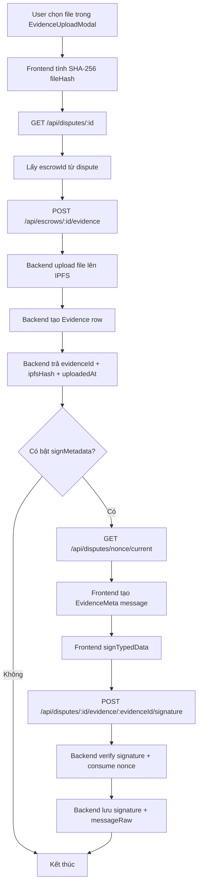

# Evidence Upload + Signature Flow

Tài liệu này mô tả luồng upload evidence, lưu IPFS hash, ký metadata, và các API route tham gia.

## Mục tiêu

- Upload file evidence lên IPFS và lưu record vào database.
- Lưu `ipfsHash` để đối chiếu lại nội dung file sau này.
- Ký metadata của evidence để chống sửa đổi / replay.
- Giải thích rõ route nào làm gì trong luồng này.

## Kết luận ngắn

- `uploadEvidence` là bước lưu file và tạo evidence record.
- `signEvidence` là bước ký metadata của evidence và lưu chữ ký vào database.
- `ipfsHash` hiện đang được lưu trong cột `Evidence.fileUrl` và được trả ra ở response upload dưới tên `ipfsHash`.
- `timestamp` có thể dùng `createdAt` của evidence để hiển thị thời điểm tạo, còn nếu muốn ký `timestamp` thì nó nằm trong signed message và `messageRaw`.

## API routes tham gia

### 1. Lấy chi tiết dispute để suy ra `escrowId`

- `GET /api/disputes/:id`
- File: `backend/src/routes/disputes.js`
- FE dùng route này để lấy `escrowId` trước khi gọi route upload evidence.

### 2. Lấy nonce mới nhất trước khi ký metadata

- `GET /api/disputes/nonce/current`
- File: `backend/src/routes/disputes.js`
- Dùng cho mediator / uploader khi cần ký payload có nonce.

### 3. Upload evidence file lên IPFS và tạo record

- `POST /api/escrows/:id/evidence`
- File: `backend/src/routes/evidence.js`
- Đây là route chính để upload file evidence.
- Backend sẽ:
  - kiểm tra quyền tham gia escrow
  - upload file lên IPFS
  - tính `merkleRoot`
  - tạo row `Evidence`
  - lưu `fileUrl` là đường dẫn / CID IPFS
  - trả response có `ipfsHash`, `fileHash`, `uploadedAt`

### 4. Lấy danh sách evidence của dispute

- `GET /api/disputes/:id/evidence`
- File: `backend/src/routes/disputes.js`
- FE dùng để render timeline / danh sách evidence.

### 5. Ký metadata của evidence

- `POST /api/disputes/:id/evidence/:evidenceId/signature`
- File: `backend/src/routes/disputes.js`
- Backend sẽ:
  - kiểm tra `disputeId`, `escrowId`, `evidenceId`
  - verify EIP-712 signature
  - consume nonce
  - lưu `signature` và `messageRaw` vào bảng `Evidence`

## Luồng chi tiết

## Dữ liệu được lưu ở đâu

### Khi upload file

- `Evidence.fileUrl` lưu đường dẫn / CID IPFS.
- `Evidence.fileHash` lưu SHA-256 của nội dung file.
- `Evidence.merkleRoot` lưu root để đối chiếu bộ evidence.
- `Evidence.createdAt` là thời điểm tạo record.

### Khi ký metadata

- `Evidence.signature` lưu chữ ký EIP-712.
- `Evidence.messageRaw` lưu toàn bộ payload đã ký.
- Nếu payload có `timestamp`, nó nằm trong `messageRaw`.

## Vai trò của `ipfsHash`

- Dùng để truy ra nội dung file đã upload.
- Dùng cho đối chiếu sau này nếu cần audit evidence.
- Không bắt buộc phải có cột riêng nếu đang map nó qua `fileUrl`.
- Nếu muốn schema rõ nghĩa hơn, có thể đổi `fileUrl` thành `ipfsHash` hoặc thêm cột riêng.

## Vai trò của `timestamp`

- Nếu chỉ cần thời điểm upload, có thể dùng `createdAt`.
- Nếu muốn timestamp nằm trong chữ ký, phải thêm nó vào EIP-712 message ở cả FE và BE.
- Hiện tại timestamp không cần cột riêng để lưu, vì `messageRaw` đã giữ payload đã ký.

## Frontend files liên quan

- `frontend/src/components/dispute/EvidenceUploadModal.jsx`
- `frontend/src/services/dispute.service.js`
- `frontend/src/utils/signatureUtils.js`

## Backend files liên quan

- `backend/src/routes/evidence.js`
- `backend/src/routes/disputes.js`
- `backend/src/types/dispute-typed-data.js`
- `backend/prisma/schema.prisma`

## Ghi chú

- Upload evidence đang đi qua route escrow vì route đó đang là nơi thật sự tạo evidence record.
- Route signature vẫn nằm trong disputes vì nó gắn với dispute context và verify chữ ký theo dispute.