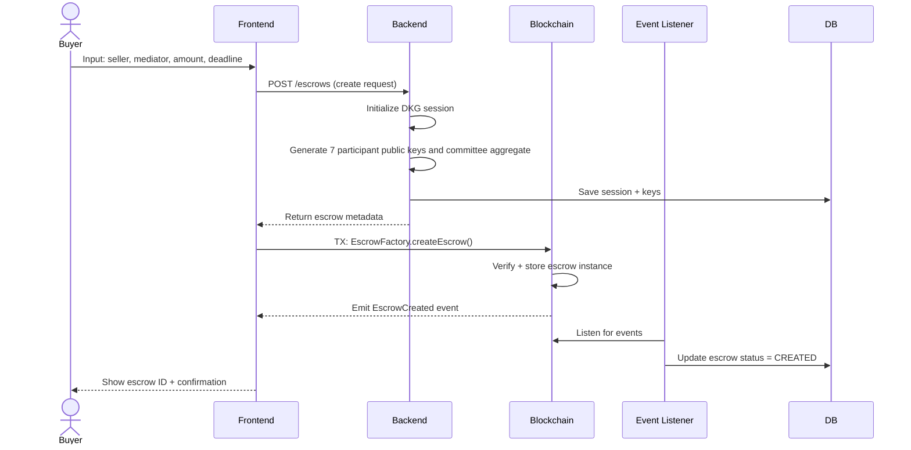
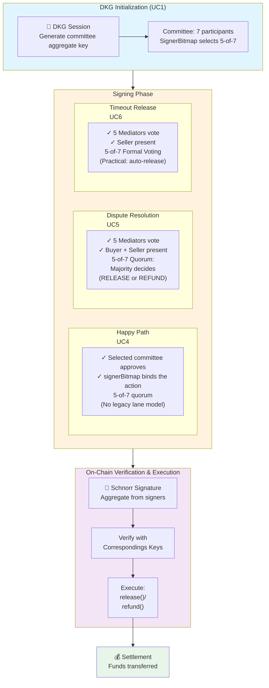
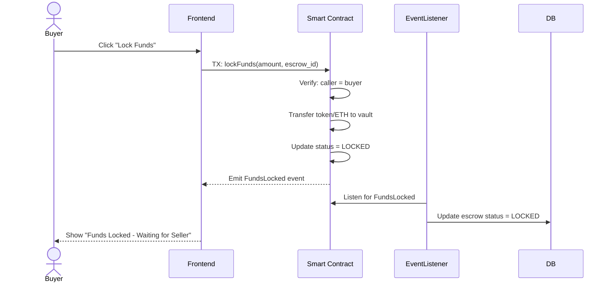
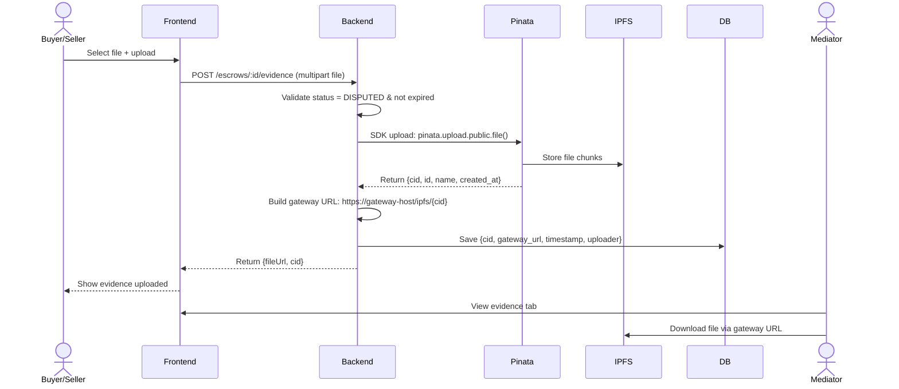
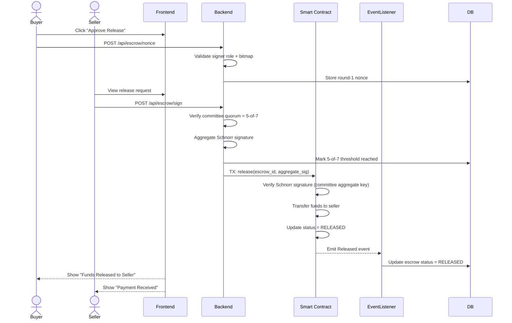
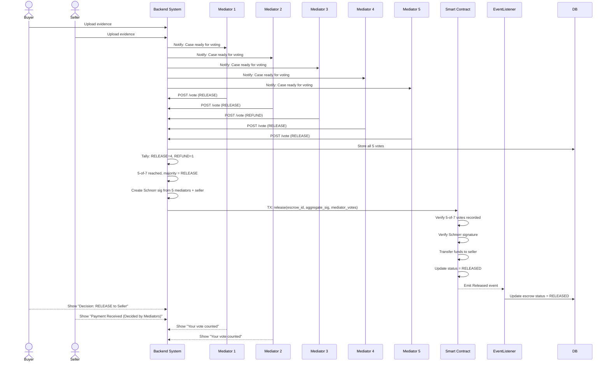
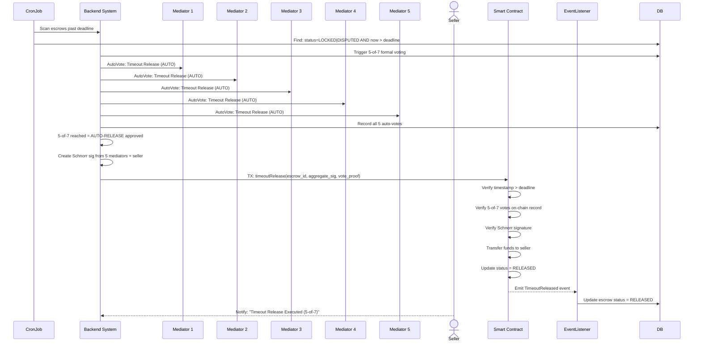

## Phần 0: Escrow Lifecycle Overview

```mermaid
stateDiagram-v2
    [*] --> CREATED: UC1: Create Escrow
    CREATED --> LOCKED: UC2: Lock Funds\n(Buyer locks money)
    
    LOCKED --> RELEASED: UC4: Release Funds\n(Selected 5-of-7 committee agree)\nor UC6: Timeout Release
    LOCKED --> DISPUTED: Buyer initiates\ndispute
    
    DISPUTED --> RELEASED: UC5A: Mediator+Seller\nrelease to seller
    DISPUTED --> REFUNDED: UC5B: Mediator+Buyer\nrefund to buyer
    DISPUTED --> RELEASED: UC6: Timeout Release\n(Mediator+Seller)
    
    RELEASED --> [*]: Funds transferred\nto Seller
    REFUNDED --> [*]: Funds transferred\nto Buyer
    
    note right of CREATED\n        DKG initialized\n        7 participant keys created\n        signerBitmap binds the 5-of-7 committee\n    end note\n    \n    note right of LOCKED\n        Buyer funds locked\n        in smart contract\n        Timer starts\n    end note\n    \n    note right of DISPUTED\n        Evidence window open\n        Both parties can upload\n        documents to IPFS\n    end note\n```\n\n**Key States:**\n- **CREATED**: Escrow initialized, DKG session active, 7 participant committee ready\n- **LOCKED**: Funds held in EscrowVault, awaiting action/completion\n- **DISPUTED**: Evidence period open, mediator reviews submissions\n- **RELEASED**: Funds transferred to Seller (happy path or timeout)\n- **REFUNDED**: Funds transferred to Buyer (mediator decision)\n\n---\n\n## Phần 1: Use Cases
```
## UC1: Tạo Giao Dịch Escrow Mới

**Mô tả**: Người mua khởi tạo một giao dịch escrow mới trên hệ thống.

**Tác Nhân Chính**: Người mua (Buyer)

**Precondition**:
- Người mua đã xác thực và đăng nhập vào hệ thống
- Người mua có ví Web3 được kết nối (MetaMask)
- Người mua biết địa chỉ ví của người bán

**Main Flow**:
1. Người mua truy cập trang tạo escrow
2. Nhập thông tin: seller address, mediator address, số tiền (amount), thời gian deadline
3. Hệ thống backend khởi tạo DKG session và tạo public keys cho 7 participants
4. Hệ thống trả về escrow metadata (id, public keys, status)
5. Frontend tạo transaction gọi `EscrowFactory.createEscrow()` on-chain
6. Polygon/blockchain xác minh syntax và lưu escrow instance
7. Event Listener nhận sự kiện -> đồng bộ DB
8. Hệ thống trả về escrow confirmation

**Alternate Flows**:
- A1: Người mua nhập sai seller address -> hệ thống validate và yêu cầu nhập lại
- A2: Blockchain transaction fails (gas insufficient, network error) -> yêu cầu retry

**Postcondition**:
- Escrow được tạo với status `CREATED`
- Public keys được lưu on-chain
- Session được lưu trữ backend với trạng thái khởi tạo

**Diagram:**


---

## Phần 1.5: TSS Cryptographic Architecture (5-of-7 Signer Committee)



**Signing Strategy:**
| Scenario | Signers | Threshold | Use Case |
|----------|---------|-----------|----------|
| **UC4: Happy Path** | Selected 5 of 7 committee | 5-of-7 | Direct release with bitmap-bound quorum |
| **UC5: Dispute** | Buyer + Seller + 5 Mediators | 5-of-7 | Majority resolves release/refund |
| **UC6: Timeout** | Seller + 4 Mediators | 5-of-7 | Formal timeout release after deadline |

---

### UC2: Lock Funds

**Mô tả**: Người mua lock tiền vào smart contract EscrowVault.

**Tác Nhân Chính**: Người mua

**Precondition**:
- Escrow tồn tại với status `CREATED`
- Người mua có đủ số tiền cần lock (+ gas fee)
- Blockchain được kết nối

**Main Flow**:
1. Người mua xem chi tiết escrow
2. Nhấn nút "Lock Funds"
3. Frontend gọi `EscrowVault.lockFunds()` với số tiền tương ứng
4. Smart contract:
   - Kiểm tra người gọi là buyer
   - Nhận token/ETH vào contract
   - Cập nhật trạng thái `LOCKED`
   - Emit event `FundsLocked`
5. Event Listener nhận event, cập nhật DB status -> LOCKED
6. Frontend nhận confirmation, hiển thị status mới

**Postcondition**:
- Tiền được khóa trong EscrowVault
- Escrow status: `LOCKED`
- Vòng đời giao dịch chính thức bắt đầu

**Diagram:**


---

### UC3: Upload Evidence trong Tranh Chấp

**Mô tả**: Người mua/bán upload bằng chứng khi có tranh chấp.

**Tác Nhân Chính**: Người mua hoặc Người bán

**Precondition**:
- Escrow status: `DISPUTED`
- Evidence window vẫn còn hạn (chưa vượt deadline)
- Người dùng là participant của escrow (buyer hoặc seller)

**Main Flow**:
1. Người mua/bán vào trang chi tiết escrow
2. Thấy tab "Dispute Evidence"
3. Nhấn "Upload Evidence"
4. Chọn file (ảnh, PDF, video) + mô tả vấn đề
5. Frontend gọi `POST /escrows/:id/evidence`
6. Backend:
   - Validate escrow status = DISPUTED
   - Validate deadline chưa vượt
   - Upload file lên Pinata IPFS (via SDK)
   - Lưu CID + gateway URL vào DB
7. Frontend nhận fileUrl, hiển thị bằng chứng vừa upload
8. WebSocket emit event `dispute-evidence-added` -> cập nhật real-time

**Postcondition**:
- Evidence được lưu on IPFS
- Gateway URL được lưu vào database
- Mediator có thể xem bằng chứng

**Diagram:**


---

### UC4: Release Funds

**Mô tả**: Người mua + người bán hợp tác ký để giải ngân (happy path).

**Tác Nhân Chính**: Nhóm signer 5-of-7 (bao gồm buyer/seller + mediators)

**Precondition**:
- Escrow status: `LOCKED`
- Nhóm signer được chọn đạt quorum 5-of-7

**Main Flow**:
1. Người mua khởi tạo release request
2. Hệ thống chọn signer committee theo policy của action
3. Các signer gửi nonce và z-share theo quy trình Schnorr
4. Backend tạo chữ ký Schnorr tổng hợp từ 5-of-7 committee
5. Gọi `EscrowVault.release()` on-chain
6. Smart contract verify chữ ký -> transfer tiền cho seller
7. Event Listener cập nhật DB -> status = RELEASED

**Postcondition**:
- Tiền được transfer cho seller
- Escrow status: RELEASED
- Giao dịch hoàn thành thành công

**Diagram (5-of-7 Committee Signing):**


---

### UC5: Refund via Mediator Voting

**Mô tả**: 5 Mediators vote để quyết định hoàn tiền cho buyer hoặc phát hành cho seller (5-of-7 quorum).

**Tác Nhân Chính**: 5 Mediators, Buyer, Seller

**Precondition**:
- Escrow status: `DISPUTED`
- 5 Mediators đã được assign và accepted
- Cả Buyer & Seller đã upload evidence
- Review deadline chưa vượt quá

**Main Flow**:
1. 5 Mediators vào trang escrow
2. Review evidence từ cả Buyer & Seller
3. Mỗi Mediator quyết định: "RELEASE to Seller" hoặc "REFUND to Buyer"
4. Mỗi Mediator gọi `POST /escrows/:id/vote` với lựa chọn của họ
5. Backend:
   - Verify mediator xác thực
   - Lưu vote vào DB với timestamp
   - Check nếu đã đủ 5-of-7 votes
6. Khi 5-of-7 threshold đạt được:
   - Tính toán majority (RELEASE hoặc REFUND)
   - Tạo Schnorr signature từ 5 mediators + gating party (buyer/seller)
7. Gọi `EscrowVault.release()` hoặc `EscrowVault.refund()` on-chain
8. Smart contract verify signature -> transfer tiền
9. Event Listener cập nhật DB -> status = RELEASED hoặc REFUNDED

**Postcondition**:
- Majority vote được execute
- Tiền được transfer đến beneficiary
- Escrow status: RELEASED hoặc REFUNDED
- Tranh chấp được giải quyết

**Diagram (5-of-7 Voting - Mediator Jury):**


---

### UC6: Timeout Release

**Mô tả**: Nếu vượt deadline, 5 Mediators vote formal release cho seller (5-of-7 quorum).

**Tác Nhân Chính**: 5 Mediators & Seller

**Precondition**:
- Escrow status: `LOCKED` hoặc `DISPUTED`
- Vượt quá `reviewDeadlineAt` hoặc `decisionDeadlineAt`
- 5 Mediators đã được assign

**Main Flow**:
1. Cron job kiểm tra timeout escrows
2. Trigger formal 5-of-7 voting flow (auto-release procedure)
3. Mỗi Mediator gọi `POST /escrows/:id/vote` với lựa chọn "AUTO-RELEASE"
4. Khi 5-of-7 threshold đạt được:
   - Tạo Schnorr signature từ 5 mediators + seller
5. Gọi `EscrowVault.timeoutRelease()` on-chain
6. Smart contract verify timestamp + votes + chữ ký
7. Transfer tiền cho seller
8. Event Listener cập nhật -> RELEASED

**Postcondition**:
- Timeout được xử lý tự động với formal voting
- Tiền được release cho seller
- Giao dịch kết thúc

**Diagram (5-of-7 Formal Release):**


---

## Phần 2: User Stories
### Buyer Stories (Người Mua)

#### BS1: Tạo escrow đơn giản
```
Là một Người Mua,
Tôi muốn tạo một giao dịch escrow nhanh chóng mà không cần thiết lập phức tạp,
Để có thể mua hàng/dịch vụ từ người bán có bảo vệ.
```

**Tiêu chí chấp nhận**:
- Tôi có thể nhập seller address + số tiền trong < 2 phút
- Transaction được confirmed on-chain
- Tôi nhận được escrow ID để theo dõi

#### BS2: Lock tiền an toàn
```
Là một Người Mua,
Tôi muốn khóa tiền của mình trong một smart contract,
Để người bán không thể nhận tiền cho đến khi tôi xác nhận đã nhận hàng.
```

**Tiêu chí chấp nhận**:
- Tiền được lock on-chain (verified by blockchain)
- Tôi thấy trạng thái "Locked - Waiting for Seller"
- Tôi có thể cancel nếu seller không hoàn thành

#### BS3: Upload bằng chứng khi tranh chấp
```
Là một Người Mua trong một tranh chấp,
Tôi muốn upload ảnh/video làm bằng chứng cho yêu cầu của tôi,
Để người trung gian có thể đưa ra quyết định công bằng.
```

**Tiêu chí chấp nhận**:
- Tôi có thể upload ảnh/PDF/video > 10MB
- File được lưu on IPFS (không bị mất)
- Mediator có thể xem và download evidence
- Evidence có timestamp & verifiable on blockchain

#### BS4: Được hoàn tiền nếu thỏa thuận
```
Là một Người Mua, khi người bán đồng ý,
Tôi muốn cả hai chúng ta ký xác nhận giao dịch phát hành,
Để tôi nhận được hàng hoặc tiền được phát hành cho người bán một cách công bằng.
```

**Tiêu chí chấp nhận**:
- Release request được gửi đến seller
- Cả 2 có thể ký từ mobile/desktop
- Không cần tôi chuyển gas fee thêm (backend sponsor)

---

### Seller Stories

#### SS1: Chấp nhận đơn hàng
```
Là một Người Bán,
Tôi muốn biết khi nào người mua khóa tiền,
Để tôi có thể bắt đầu chuẩn bị gửi hàng.
```

**Tiêu chí chấp nhận**:
- Tôi nhận notification khi funds được locked
- Tôi thấy buyer info + escrow amount
- Tôi có thể chat/contact buyer

#### SS2: Nhận tiền sau khi giao hàng
```
Là một Người Bán,
Tôi muốn phát hành giao dịch khi người mua xác nhận đã nhận hàng,
Để tôi có thể nhận được thanh toán của mình.
```

**Tiêu chí chấp nhận**:
- Release request từ buyer được hiển thị rõ
- Tôi có thể ký approve + money transfer ngay
- Tiền về ví của tôi trong < 30 seconds (on-chain)

#### SS3: Phòng chống chối
```
Là một Người Bán, khi giao dịch bị tranh chấp,
Tôi muốn upload bằng chứng cho thấy tôi đã giao hàng,
Để người trung gian có thể trao tiền cho tôi.
```

**Tiêu chí chấp nhận**:
- Tôi có thể upload tracking number, photos, video delivery
- Evidence timestamp được lưu on-chain (immutable)
- Mediator có thể verify authenticity

#### SS4: Timeout protection
```
Là một Người Bán, nếu người mua không phản hồi,
Tôi muốn phát hành tự động sau N ngày,
Để tôi không mất thanh toán của mình.
```

**Tiêu chí chấp nhận**:
- Nếu buyer không action sau 7 ngày -> cron job tự release
- Tôi được notify khi timeout release được approve
- Tiền được transfer tự động

---

### Mediator Stories

#### MS1: Xem evidence tranh chấp
```
Là một Người Trung Gian,
Tôi muốn xem lại tất cả các bằng chứng từ cả hai bên,
Để tôi có thể đưa ra một quyết định công bằng.
```

**Tiêu chí chấp nhận**:
- Tôi thấy timeline escrow (created, locked, disputed)
- Evidence từ buyer + seller được hiển thị kèm timestamp
- Tôi có thể download/verify bằng chứng on IPFS
- Evidence không thể bị sửa sau (immutable)

#### MS2: Decide release hoặc refund
```
Là một Người Trung Gian,
Tôi muốn lựa chọn: phát hành cho người bán HOẶC hoàn tiền cho người mua,
Để tranh chấp được giải quyết công bằng.
```

**Tiêu chí chấp nhận**:
- Tôi có 2 button: "Release to Seller" / "Refund to Buyer"
- Quyết định được recorded on blockchain
- Chữ ký của tôi (mediator) + co-signer (seller/buyer) được verify
- Quyết định không thể bị reverse sau khi confirm

#### MS3: Track mediator performance
```
Là một Người Trung Gian,
Tôi muốn xem thống kê của tôi: tổng tranh chấp đã giải quyết, thời gian quyết định, rating phản hồi,
Để tôi biết danh tiếng của mình.
```

**Tiêu chí chấp nhận**:
- Dashboard hiển thị: # cases, avg resolution time, user ratings
- Tôi có thể export report hàng tháng
- Rating được transparent (verifiable on blockchain)

---

## Phần 3: Mapping Use Cases -> User Stories

| Use Case | User Stories | Role |
|----------|-------------|------|
| UC1: Create Escrow | BS1, SS1 | Buyer, Seller |
| UC2: Lock Funds | BS2 | Buyer |
| UC3: Upload Evidence | BS3, SS3 | Buyer, Seller |
| UC4: Release Funds | BS4, SS2 | Buyer, Seller |
| UC5: Refund via Mediator | BS5, MS1, MS2 | Mediator, Buyer/Seller |
| UC6: Timeout Release | SS4, MS2 | Seller, Mediator |